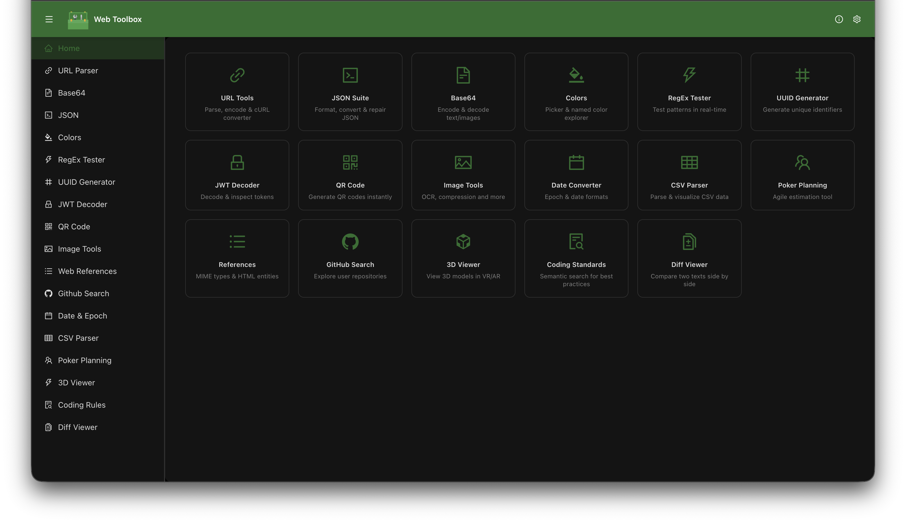
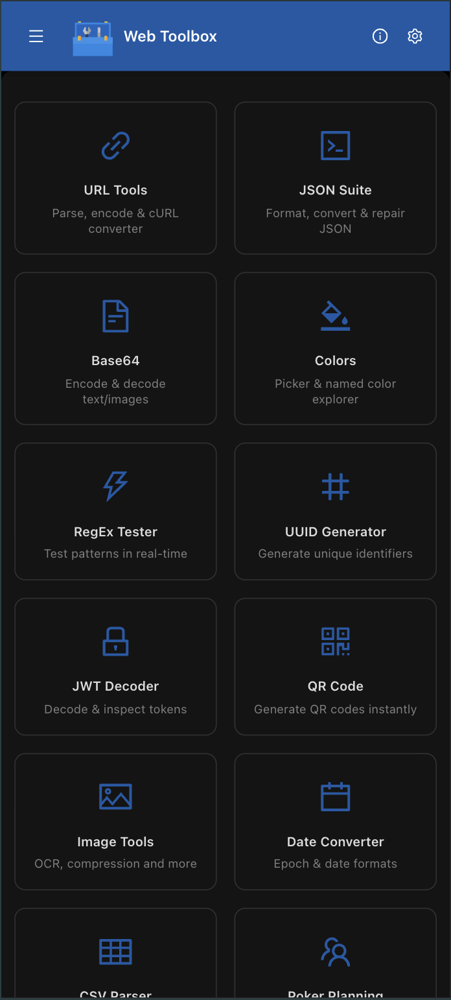

# Web Toolbox

[-7.3-646CFF.svg?style=flat-square&logo=vite>)](https://rolldown.rs/)

Open source collection of web developer utilities.
The web application has been deployed and you can use it [just here!](https://amwebexpert.github.io/etoolbox)

  
Like the project? Don't forget to give it a ⭐️!

  
Icon made by: <a href="https://therealjerrylow.com/">Jerry Low</a>

## Features

- Ad-Free Experience
  - Developer utilities with zero advertisements, providing a clean and distraction-free environment
- Privacy First
  - All processing happens directly in your browser. No sensitive data is ever sent to external servers, ensuring complete data privacy and security
- Responsive Design
  - Mobile-first approach with full support for smartphones, tablets, and desktop devices for a seamless experience across all platforms
- Industry Best Practices
  - Serve as an exemplary codebase demonstrating optimal coding patterns, clean architecture, and modern development standards for the industry

| Desktop                                                                | Mobile                                                                       |
| ---------------------------------------------------------------------- | ---------------------------------------------------------------------------- |
|  |  |

## Getting Started

1. Install [uv](https://docs.astral.sh/uv/) (Python 3.11+, required for local lint coaching)
2. Install dependencies: `bun install` (also installs [habit-hooks](https://github.com/habit-hooks/habit-hooks) automatically)
3. Start the dev server: `bun start` (http://localhost:5173)

See [CONTRIBUTING.md](./CONTRIBUTING.md) for full contributor setup and conventions.

## Development commands

| Script                        | Description                                                                             |
| ----------------------------- | --------------------------------------------------------------------------------------- |
| `bun start`                   | Alias for `bun dev` - starts the development server                                     |
| `bun dev`                     | Starts Vite development server with hot reload                                          |
| `bun run build`               | Builds the production application (cleans dist, generates version, compiles TypeScript) |
| `bun run preview`             | Previews the production build locally (from `dist/`)                                    |
| `bun run deploy`              | Rebuilds the app and moves output to `docs/` for GitHub Pages deployment                |
| `bun run test`                | Runs tests with Vitest                                                                  |
| `bun run test:e2e`            | Runs Playwright e2e tests (Chromium desktop)                                            |
| `bun run test:e2e:ui`         | Runs e2e tests in Playwright UI mode                                                    |
| `bun run test:e2e:responsive` | Runs e2e tests on mobile and tablet viewports                                           |
| `bun run test:e2e:all`        | Runs e2e tests across all Playwright projects                                           |
| `bun run test:e2e:report`     | Opens the HTML test report                                                              |
| `bun run lint`                | Runs habit-hooks code-quality coaching on the codebase                                  |
| `bun run typecheck`           | Runs TypeScript type checking without emitting files                                    |
| `bun run format`              | Formats code with Prettier                                                              |
| `bun run format:check`        | Checks code formatting without making changes                                           |
| `bun run clean:node`          | Removes `node_modules` and `bun.lock` for a fresh install                               |
| `bun run generate:version`    | Generates version information file                                                      |
| `bun run generate:api:client` | Generates API client from OpenAPI specification                                         |
| `bun run postinstall`         | Runs after install: applies patches and installs habit-hooks                            |

Playwright starts the Vite dev server automatically via [e2e/playwright.config.ts](./e2e/playwright.config.ts). E2E tests run locally only (not in CI).

## Frameworks & Dependencies

| Package                                                                                      | Description                                        |
| -------------------------------------------------------------------------------------------- | -------------------------------------------------- |
| [React](https://react.dev/)                                                                  | UI library for building component-based interfaces |
| [TypeScript](https://www.typescriptlang.org/)                                                | Type-safe JavaScript superset                      |
| [Ant Design](https://ant.design/)                                                            | Enterprise-class UI component library              |
| [TanStack Router](https://tanstack.com/router)                                               | Type-safe routing for React                        |
| [TanStack Query](https://tanstack.com/query)                                                 | Async state management and data fetching           |
| [Zustand](https://zustand-demo.pmnd.rs/)                                                     | Lightweight state management                       |
| [Immer](https://immerjs.github.io/immer/)                                                    | Immutable state with mutable syntax                |
| [@lichens-innovation/ts-common](https://www.npmjs.com/package/@lichens-innovation/ts-common) | Shared TypeScript utilities                        |
| [@uidotdev/usehooks](https://usehooks.com/)                                                  | Collection of React hooks                          |

## Development Tools

| Package                                                   | Description                                   |
| --------------------------------------------------------- | --------------------------------------------- |
| [Vite (Rolldown)](https://rolldown.rs/)                   | Next-generation fast build tool               |
| [Vitest](https://vitest.dev/)                             | Unit testing framework                        |
| [Playwright](https://playwright.dev/)                     | End-to-end browser testing                    |
| [ESLint](https://eslint.org/)                             | JavaScript/TypeScript linting                 |
| [habit-hooks](https://github.com/habit-hooks/habit-hooks) | Code-quality coaching (powers `bun run lint`) |
| [Prettier](https://prettier.io/)                          | Code formatting                               |
| [Husky](https://typicode.github.io/husky/)                | Git hooks management                          |
| [Commitlint](https://commitlint.js.org/)                  | Commit message linting                        |

## Technical Notes

- [Technical notes](./TECH_NOTES.md)

## License

This project is licensed under the MIT license. For more information see [`LICENSE`](./LICENSE) file.

## Contributing & Community Guidelines

We value **technical excellence and human respect equally**. To ensure a welcoming and productive environment for all contributors, please review the following resources:

| Resource                                                                                                                                                       | Description                                                           |
| -------------------------------------------------------------------------------------------------------------------------------------------------------------- | --------------------------------------------------------------------- |
| [Code of Conduct](./CODE_OF_CONDUCT.md)                                                                                                                        | Our pledge for a respectful, inclusive, and collaborative environment |
| [Contributing Guide](./CONTRIBUTING.md)                                                                                                                        | How to get started, project conventions, and pull request guidelines  |
| [Coding Guidelines](https://github.com/amwebexpert/chrome-extensions-collection/blob/master/packages/coding-guide-helper/public/markdowns/table-of-content.md) | Best practices for clean, maintainable, and scalable code             |

Adhering to established coding guidelines is essential for developing efficient, maintainable, and scalable software. These guidelines promote consistency across the codebase, making it easier for teams to collaborate and for new developers to understand existing code.
