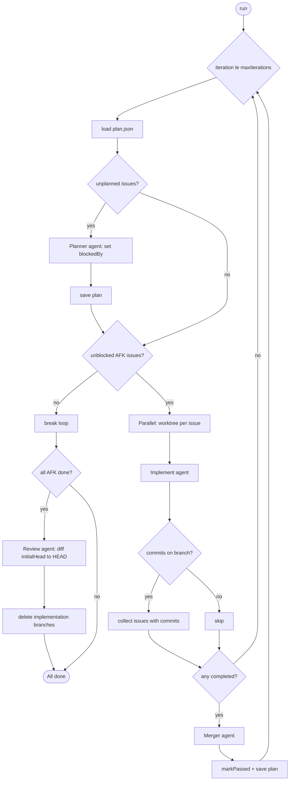
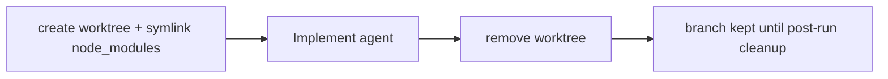
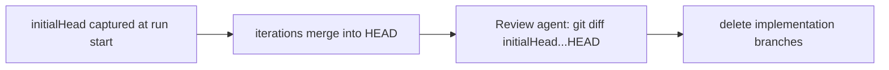

# AI Orchestrator

The AI orchestrator drives a multi-issue implementation plan from [plan.json](plan.json): it plans dependencies, implements AFK (away-from-keyboard) issues in isolated git worktrees, merges successful branches into the main repo, runs a final review over all accumulated changes, and cleans up implementation branches when all AFK work is done.

Skills to run in order to produce the `plan.json`

- grill-with-docs
- to-prd
- to-issues-as-json

## Running

Entry point: [main.ts](main.ts) — resolves the repository root (`..`), `plan.json`, and `logs/`.

```bash
bun run ai:run:plan
```

This runs `npx tsx ai-orchestrator/main.ts`.

## Plan file (`plan.json`)

Each issue in `plan.json` follows the [Issue](utils/orchestrator.types.ts) shape:

| Field                                              | Role                                                                         |
| -------------------------------------------------- | ---------------------------------------------------------------------------- |
| `id`, `title`, `whatToBuild`, `acceptanceCriteria` | Fed to the implement agent                                                   |
| `type`                                             | `AFK` (automated) or `HITL` (human-in-the-loop; skipped by the orchestrator) |
| `isPlanned`, `blockedBy`                           | Set by the planning phase                                                    |
| `passes`                                           | Set to `true` after a successful merge                                       |

An issue is **unblocked** when it is `isPlanned`, not yet `passes`, has `type === "AFK"`, and every id in `blockedBy` has `passes: true` (see [plan.ts](utils/plan.ts) `getUnblocked()`).

The plan file is reloaded at the start of each iteration and saved after planning and merge phases.

## Workflow

`Orchestrator.run()` in [orchestrator.ts](orchestrator.ts) runs up to `maxIterations` (default **20**). Each iteration:

1. **Reload plan** — `plan.load()` re-reads `plan.json` from disk.
2. **Planning** — If any issue has `isPlanned: false`, the **planner** agent runs (`prompts/plan.md`) with the full plan JSON. It returns `{ id, blockedBy }[]`; the orchestrator calls `markPlanned` and saves the plan.
3. **Select work** — `getUnblocked(2)` returns up to **2** unblocked AFK issues per iteration (`MAX_PARALLEL_UNBLOCKED_IMPLEMENTERS`). If there are no unblocked issues, the loop exits (logs distinguish: all AFK complete vs. blocked/circular dependency vs. remaining HITL).
4. **Implementation** — Selected issues run in parallel via `Promise.allSettled`:
   - Branch name: `orchestrator/implementation-task-{issueId}`
   - [withWorktree](utils/worktree.utils.ts) creates a worktree under `.orchestrator-worktrees/`, symlinks `node_modules`, runs the **Implement** agent (`implement.md`), then removes the worktree in `finally`
   - Collect issues whose branch has commits not on `HEAD` (`hasCommits`); failures are logged and the iteration continues
5. **Merge** — If any issue produced commits this iteration, the **merger** agent (`merge.md`) runs in the main repo. Structured output `{ merged, failed }`; merged issue ids get `markPassed` and the plan is saved.
6. If no issue produced commits, skip merge and start the next iteration.

After the loop, if there are **no remaining AFK issues** (`remainingAfkIssues.length === 0`):

1. **Review** — A single **review** agent run (`review.md`) in the main repo. It diffs `initialHead` (the repo HEAD captured at the start of `run()`) against current `HEAD`, applying project standards and optional refactors. See [review.md](prompts/review.md) for the full process.
2. **Cleanup** — Deletes `orchestrator/implementation-task-*` branches for passed AFK issues.

## Agents

| Phase     | Prompt                               | Model             | Working directory | When |
| --------- | ------------------------------------ | ----------------- | ----------------- | ---- |
| Plan      | [plan.md](prompts/plan.md)           | claude-opus-4-7   | repo root         | Each iteration with unplanned issues |
| Implement | [implement.md](prompts/implement.md) | claude-opus-4-7   | worktree          | Per unblocked issue (up to 2 in parallel) |
| Merge     | [merge.md](prompts/merge.md)         | claude-sonnet-4-6 | repo root         | After each iteration with commits |
| Review    | [review.md](prompts/review.md)       | claude-sonnet-4-6 | repo root         | Once, after all AFK issues pass |

Agent execution uses the Claude Agent SDK in [agent.utils.ts](utils/agent.utils.ts). Per-agent logs are written under `logs/` via [agent-logger.utils.ts](utils/agent-logger.utils.ts).

## Worktrees and branches

- Implementation branches: `orchestrator/implementation-task-{issueId}`
- Worktrees live under `.orchestrator-worktrees/` (branch slashes become `--` in the directory name)
- The worktree is removed after each issue’s implement callback; the branch may remain until global cleanup
- Review runs on the main repo after all AFK issues have `passes: true`, before branch cleanup
- Branch cleanup runs immediately after the review phase

## Project layout

```
ai-orchestrator/
  main.ts              # CLI entry
  orchestrator.ts      # Orchestrator class
  plan.json            # Issue backlog (mutable at runtime)
  prompts/             # Agent prompt templates
  utils/               # plan, worktree, agent helpers
  logs/                # Per-agent run logs (created at runtime)
```

## Workflow diagram

Main iteration loop:



Per-issue worktree lifecycle:



Post-run review (main repo, all AFK issues complete):


